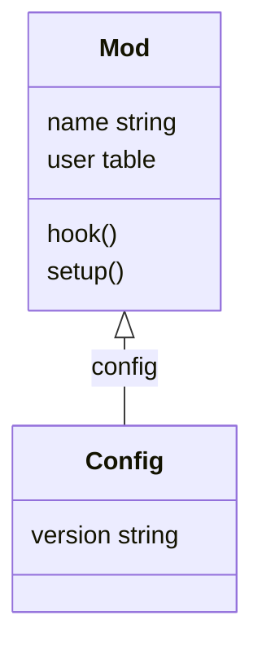

# test

## test 2

- [link](#test-3)
- [link to other](other.md)
- [link to url](https://github.com/clpi/word.lua)
- [file](./init.lua)

> [!Note]
>
> This is a note

### test 3

```lua
require("word").setup({
  mod = {
    config = {},
    workspace = {
      config = {
        workspaces = {
          home = "~/notes"
        }
      }
    }
  }
})
```
```mermaid
graph G
  A-->B
  A-->C
  B-->D
  C-->D
```


